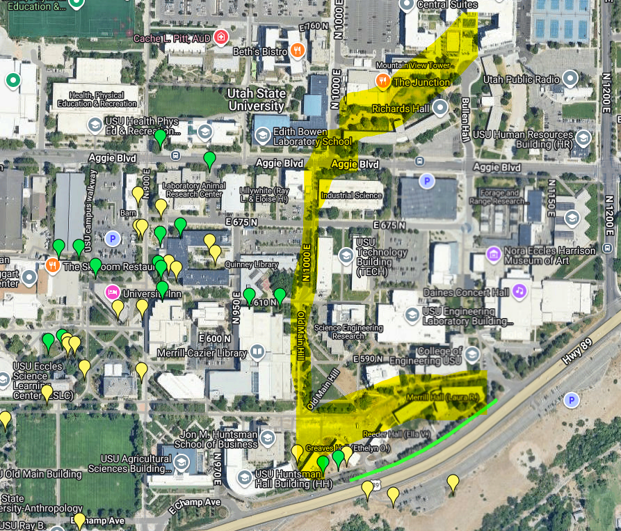
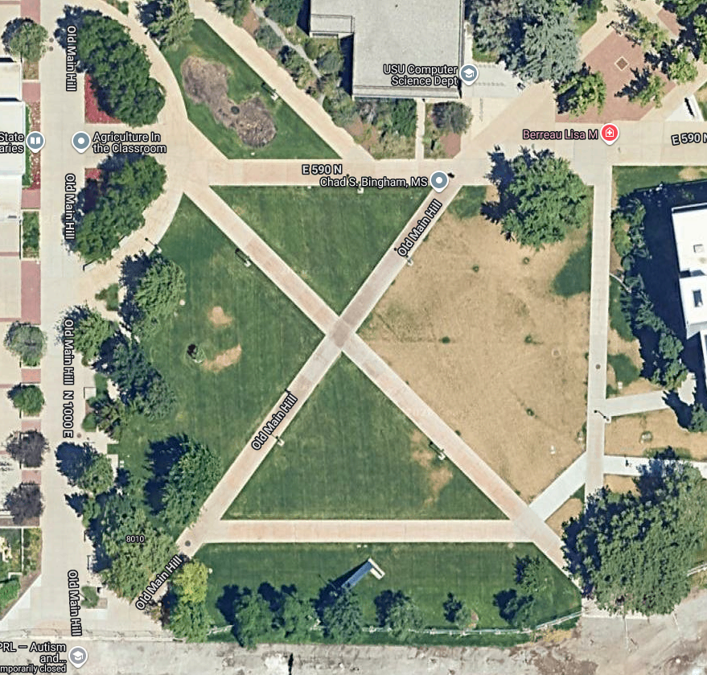
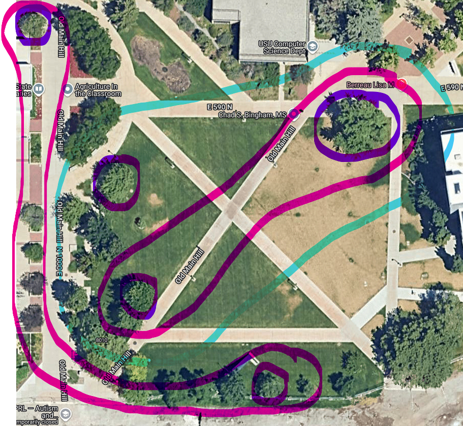
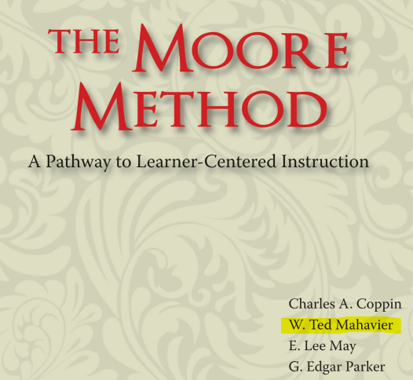
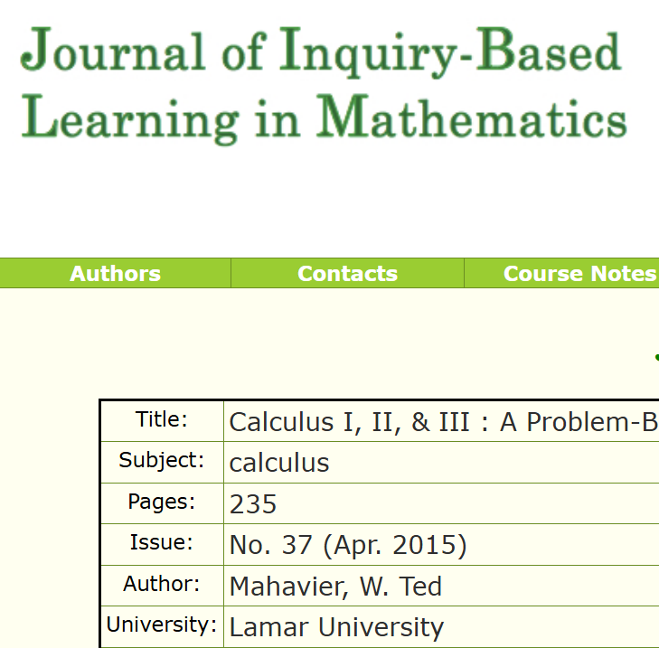
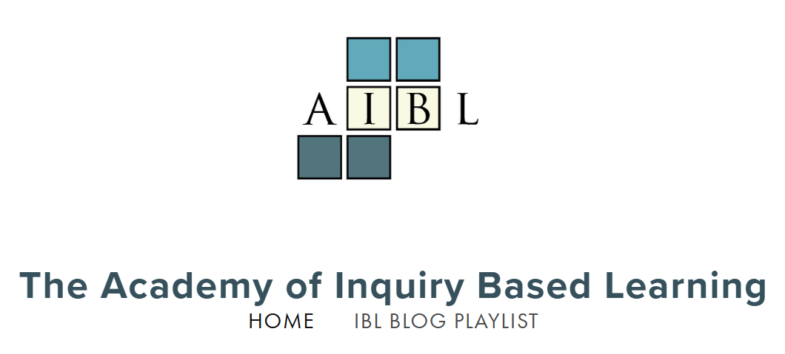

## College Freshman: USU 1997

::: {style="display: grid;"}
::: {.fragment .fade-in-then-out style="grid-area: 1 / 1;"}
Math Parties

{width="50%" fig-align="center"}
:::

::: {.fragment .fade-in-then-out style="grid-area: 1 / 1;"}
Something completely different.

{width="50%" fig-align="center"}
:::

::: {.fragment .fade-in style="grid-area: 1 / 1;"}
Did you say basis for a topology?

{width="50%" fig-align="center"}
:::
:::

---

## Grad School: BYU 2001-2005

::: {.incremental}
- Teaching Multivariable calculus
  - "You're the teacher, not the book" - Dr. Cannon
- Problem: A third of the students were failing
  - Consulted Department Chair
- Solution:
  - That's normal
:::

---

## First Few Years: BYU -- I 2005-10

::: {.incremental}
- Continued Teaching Multivariable calculus
- Problem: 48 students start, but 33 finish
  - Consulted with colleagues
:::

::: {style="display: grid;"}
::: {.fragment .fade-in-then-out style="grid-area: 1 / 1;"}
- Attempted Solutions:
  - Change the order?
  
:::
::: {.fragment .fade-in-then-out style="grid-area: 1 / 1;"}
- Attempted Solutions:
  - Better slides?
  
:::

::: {.fragment .fade-in-then-out style="grid-area: 1 / 1;"}
- Attempted Solutions:
  - More group discussion?
    - Raised morale?

:::

::: {.fragment .fade-in-then-out style="grid-area: 1 / 1;"}
- Attempted Solutions:
  - A new book?

:::

::: {.fragment .fade-in-then-out style="grid-area: 1 / 1;"}
- Attempted Solutions:
  - More technology?

:::

::: {.fragment .fade-in-then-out style="grid-area: 1 / 1;"}
- Attempted Solutions:
  - Accept it? Maybe the status quo is OK?
  
:::
:::

---

## The Key: A Productive Struggle

::: {.incremental}
- "I didn't know what the test was asking?"
  - Does repetitive homework help build language?
- When do I really learn?
  - When I engage in a productive struggle
  - (MATH) Mistakes Allow Thinking to Happen

:::

::: {style="display: grid;"}
::: {.fragment .fade-in-then-out style="grid-area: 1 / 1;"}
- Where is the struggle for students? 

:::
::: {.fragment .fade-in-then-out style="grid-area: 1 / 1;"}
- Where is the struggle for students?
  - Exams?

:::
::: {.fragment .fade-in-then-out style="grid-area: 1 / 1;"}
- Where is the struggle for students?
  - Quizzes?

:::
::: {.fragment .fade-in-then-out style="grid-area: 1 / 1;"}
- Where is the struggle for students?
  - Homework?

:::
::: {.fragment .fade-in-then-out style="grid-area: 1 / 1;"}
- Where is the struggle for students?
  - Group work?

:::
::: {.fragment .fade-in-then-out style="grid-area: 1 / 1;"}
- Where is the struggle for students?
  - Prep work?
  
:::
:::

---

## Section Meeting: SUU 2011

Keynote address: Transformative Experiences by Ted Mahavier

::: {style="display: grid;"}
::: {.fragment .fade-in-then-out style="grid-area: 1 / 1;"}
{width="50%" fig-align="center"}
:::

::: {.fragment .fade-in-then-out style="grid-area: 1 / 1;"}
{width="50%" fig-align="center"}
:::

::: {.fragment .fade-in style="grid-area: 1 / 1;"}
{width="70%" fig-align="center"}

:::
:::

---

## Will This Work?

::: {.incremental}
- I was terrified
  - What if the students don't prepare?
  - What if they present incorrect information?
  - Will I be able to answer their questions? 
  - Will we finish the content?
- What if the pass rate drops?
:::

---

## Trust Your Students!

::: {.incremental}
- I decided to trust the students
  - Trust they will prepare!
  - Trust they will learn from incorrect attempts!
  - Trust I will learn to help them answer their questions!
  - Trust they will learn far more than I could imagine!
- And maybe, just maybe, the pass rate can go up?
  - I was still terrified. {width="40%"}

:::

---

## Start Simple

::: {.incremental}
- Calc I and Calc II
  - Used prebuilt materials
  - Have a Mentor
  - Trusting the students is a win 
  - Students created solutions I'd never considered
  - Fine tune tasks for your audience

:::

---

## A Typical Day

::: {.incremental}
- Prep: Spend 1-2 hours working on the next 4-8 tasks.
- Brain Gains:  10-20 minutes 
  - Try on your own, get immediate feedback.
- Group Discussion: 10-30 minutes
  - Work together at the chalkboards
  - I find presenters
- Student Presentations: 15-30 minutes
  - Explain thought process.
  - It's OK to be wrong.
  
:::

---

## My First Problem Set

::: {.incremental}
- Multivariable Calculus
  - Wrote problem set tailored to my students
  - The pass rate? 
    - 46 of 48 passed
    - Same assessment structure as before
  - Repeatable? Can I find presenters?
    - Yes - 85-95% pass rate for 15 years
    - No - A few teach many - back to 66-80%
    - Does no harm
  
:::

---

## A little overboard

Where else can IBL help?

- Differential Equations
- Linear Algebra
- Intro to Analysis
- Abstract Algebra
- PDEs
- Statistics
- Math for the real world?

---

## Side Effect: A Growth Mindset

::: {.incremental}
- IBL was cultivating a growth mindset
  - *Birds don't just fly they fall down and get up. Nobody learns without getting it wrong.* -- Zootopia
- Problem: Traditional assessment fought against that
  - *Make one wrong move and you're done for. Anything I don't approve of, you're done for.* -- Epic The Musical
- Solution: Justify 
  - *And how do we keep our balance? That I can tell in one word. Tradition!* --  Fiddler on the Roof

:::

---

## How One Banquet Changed My Classroom

::: {.incremental}
- SUU 2019
- *I give traditional exams to help students prepare for qualifiers in graduate school.* - Me
- And one colleague gave a candid reply

:::

::: {.fragment style="text-align: center;"}
😬
:::

---

## Covid Sabbatical

::: {.incremental}
- *Punished by Rewards* by Alfie Kohn
  - *Punished by Misunderstanding* by David Reitman
  - Agreement on mastery learning
- *Specifications Grading: Restoring Rigor, Motivating Students, and Saving Faculty Time* by Linda B. Nilson
- *Specifications grading: We may have a winner* by Robert Talbert
- The Grading Conference - Online archive
:::

---

## Specs Grading In Calc III

::: {.incremental}
- (Skills check) 32 objectives
  - Weekly quiz - grows each week
  - Binary grading: Pass/Not yet 
    - Is there something left to learn?
  - Many attempts to pass each objective
  - Single/Double pass
  - Must pass 80% to pass class with a C or higher
- (IBL) Present your work: Keep up with peers
- Self-directed learning (SDL) projects: One per unit
:::

---

## Grades

::: {.incremental}
- C: Pass 80% of objectives. 
- B: Complete C specs. Keep up with peers in presenting (80% of median). Complete 3 self-directed learning (SDL) projects.
- A: Complete B specs. Complete a total of 6 (SDL) projects.
- There is no percent structure. You either meet the specifications for a grade or you don't. 

:::

---

## Self-Directed Learning Projects

::: {.incremental}
- Andragogy
- Modeled after BYU-I professional development leaves.
  - Have a goal. Explain relevance to the unit.
  - Make a plan. 
  - Create something to publicly share. (Harvard's CS50)
  - Submit a proposal.
- Time: 5-8 hours

:::

---

## SDL Examples

::: {.incremental}
- How does (insert topic) get used in my major?
- I want to learn how to do (insert topic) with python
- YouTube introduction to Mathematica 
- Create a functioning roller coaster in Desmos
- Build a fully decorated Christmas tree in Mathematica
- Use Tkinter to create a visualization suite, share on GitHub
- Use AI to have LeBron James teach Lagrange multipliers
- Leverage AI to build a frisbee golf HTML game 

:::

---

## A New "Hiccup": LLMs?

::: {.incremental}
- How do we have a productive struggle? 
  - Student presentations sometimes include "AI said so"
- Did LLMs flip Bloom's Taxonomy?
  - Generative AI starts at *Create*
  - How can we leverage this?
  - Are we experimenting with it?
- What used to be a 5-8 hour SDL project now takes 20 sec

:::

---

## Vibe Coding: Bell Hero

::: {.incremental}
- Church song time
- Colored hand bells in supply closet
- Let's have a guitar hero style game
- Vibe code it.
  - Only use English language prompts 
  - How well can it do?
  - Sound detection fiasco. FFT fun. 

::: 

---

## A Cryptography Example

::: {.incremental}
- Introduction to mathematical sciences course.
- Many students have never coded or used AI. 
- Leverage school's Gemini account with Google CoLab.
  - Students build simple Caesar cipher using AI.
  - Change key to sequence.
  - Add alphabet flip as option
- Students left feeling empowered

:::

---

## Conclusion: A New Tradition

::: {.incremental}
- How often do we justify with "Tradition" 
  - *The status quo is unacceptable* - MAA Common Vision
* What is a "Productive Struggle" in 2026?
  - How will we leverage new technology?
* Let's build our future traditions by design, not by default.

:::

---

## Done For {background-color="#1a1a1a"}

::: {style="width: 50%; margin: auto;"}

:::

---

## How do we keep our balance? {background-color="#1a1a1a"}

::: {style="width: 90%; margin: auto;"}

:::

---

## How did this begin {background-color="#1a1a1a"}

::: {style="width: 90%; margin: auto;"}

:::

---

## Thank You!
